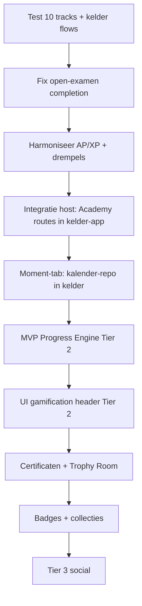

# Strategie → implementatie — leidraad

**Datum:** juni 2026  
**Status:** referentiedocument voor Romuald + AI-assistent (Cursor)  
**Doel:** vertalen van Tier 1/2/3-strategie naar wat er al staat, wat ontbreekt, en hoe drie repo’s samenkomen in **één Way of Tasting dranken-app**.

**Gerelateerd:** [`README.md`](README.md) · [`WAY_OF_TASTING_ARCHITECTURE_V2.md`](WAY_OF_TASTING_ARCHITECTURE_V2.md) · [`../INTEGRATIE.md`](../INTEGRATIE.md)

---

## 1. Context — één product, drie ontwikkelingsspooren

Way of Tasting is **één ecosysteem** met meerdere engines (architectuur v2):

| Tab / engine | Rol | Repo |
|--------------|-----|------|
| 🍷 **Drank** | Voorraad, scan, kelder — **host-app** | `dev-way-of-wine-exploring-app` |
| 🌙 **Moment** | Biodynamische kalender, timing, drinkadvies | `biodynamische-kalender` → integreren in kelder-tab |
| 🎓 **Academy** | Opleidingen, certificering, gamification (LMS) | `dev-way-of-tasting-academy` → integreren in kelder-tab |
| 🍽 Pairing, 🍷 Proverij, 👥 Community | Toekomst / deels al in kelder | Kelder-repo |

**Besluitrichting:** de **dranken-app is het host-product**. Academy en biodynamische kalender zijn geen losse eindproducten op termijn — wel **losse repo’s tijdens ontwikkeling**, met gedeelde Supabase en uiteindelijk **één navigatie, één login, één profiel**.

**Architectuur-principe (biodynamiek):**

- **Moment** = toepassen (welke fles, welk moment, welk advies)
- **Academy track Biodynamisch** = begrijpen (waarom dagtypes, weer en timing ertoe doen)

De opleiding vervangt de kalender niet; ze versterken elkaar.

---

## 2. Beoordeling strategiedocumenten

### Sterk

- **Gelaagde tiers** — Tier 1 = waarom, Tier 2 = hoe bouwen, Tier 3 = schaal/ social. Juiste volgorde.
- **Sluit aan op bestaande code** — module-niveaus `explorer` / `specialist` / `master`, lesflow theorie → praktijk → quiz, 10 content-tracks.
- **Gamification-filosofie** — Learn → Earn → Collect → Unlock → Return past bij Academy + kelder-identiteit.
- **Ecosysteemvisie** — [`WAY_OF_TASTING_ARCHITECTURE_V2.md`](WAY_OF_TASTING_ARCHITECTURE_V2.md) beschrijft waar Academy naast Moment en Drank staat.

### Harmoniseren vóór bouw gamification

| Onderwerp | Document A | Document B | Actie |
|-----------|------------|------------|--------|
| Valuta | Cert v2: **Academy Points** | Gamification v1 + Engagement: **XP** | **Eén canonical tabel** — kies AP = XP of twee laag (AP account, XP events) |
| Quiz-beloning | Cert: **15 AP** | Gamification: **20 XP** | Eén bedrag vastleggen |
| Module-examen | Cert: **50 AP** | Gamification: **100 XP** exam | Idem |
| Slagingsdrempel quiz | Content (o.a. BIO): **80%** | Code: **70%** (`packages/academy-shared/src/lessonProgress.ts`) | Eén default + override per `lesson_type` |
| Ranks | Cert: Novice → Master of Tasting (account) | Modules: Explorer/Specialist/Master (per track) | Expliciet onderscheid **account rank** vs **track-certificaat** vs **Hall of Achievement-titel** |
| Curriculum | Framework 2.0: 8 vaste pijlers | Biodynamisch / Bier 0.0: eigen opbouw | Framework = **richtlijn**, geen harde constraint |

**Aanbevolen nieuw document (Tier 1.5):** `REWARDS_AND_PROGRESS_CANON.md` — samenvoeging Cert v2 + Gamification XP + Engagement events (events → punten → UI).

---

## 3. Audit — strategie vs. opgeleverd (Academy-repo, juni 2026)

### ✅ Match — fundamenteel klaar

| Strategie | Implementatie |
|-----------|---------------|
| 10 drankopleidingen incl. Biodynamisch | 10 tracks, seeds, `/academy`, navigatie-groepen |
| Track → Module → Les | `academy.tracks`, `modules`, `lessons` |
| Niveaus Explorer / Specialist / Master | `modules.level` + UI-fase-labels |
| Lesstructuur (leerdoel, theorie, kernbegrippen, quiz, praktijk) | Content + import/rebuild-pipeline |
| Voortgang per les | `user_lesson_progress` (theory_read, practice_completed, best_quiz_score) |
| Quiz-historie | `user_quiz_attempts` (append-only) |
| Profiel + voortgang per track | `ProfielPage`, `AcademyTrackCurriculum` |
| Quiz-feedback | `web/src/lib/quizFeedback.ts` |
| Woordenlijst | `glossaryTerms.ts`, `HighlightedProse` |
| Gedeelde auth (concept) | Zelfde Supabase-project; zie [`INTEGRATIE.md`](../INTEGRATIE.md) |
| Content-kwaliteit | [`../gaps/README.md`](../gaps/README.md) — per track audit |

### ⚠️ Gedeeltelijk

| Strategie | Gap |
|-----------|-----|
| Certificaat Explorer/Specialist/Master | Alleen tekst in feedback; **geen** `user_certificates` / UI-diploma |
| Academy Home (Tier 2 UI) | Category-overzicht ja; **geen** XP / streak / daily quest header |
| Praktijk ↔ kelder | `context_bottle_id` in DB; **niet** wired in UI |
| Biodynamisch ↔ Moment | Content track klaar; **geen** live link naar kalender-engine |
| Integratie in kelder-app | Academy draait als **eigen web** + tab-link; nog geen embedded `/academy` in kelder-build |

### ❌ Nog niet gebouwd (Tier 2/3)

- Academy Points / XP-engine, event log, ranks accountbreed  
- Badges, collecties, Trophy Room, streaks, daily quests  
- Leaderboards, community, seasonal events, economy balancing  
- Cosmetics (frames, themes)

### 🔴 Kritiek — fix vóór gamification

**Open examens / praktijklessen zonder MC-quiz** (o.a. Port theorie-examen, BIO 42–45):

- `lessonCompletionRules()` vereist vrijwel overal quiz (`quizRequired: true`)
- UI toont **“Start quiz”** ook als er geen vragen zijn
- Lessen kunnen daardoor **niet afgerond** worden

**Actie:** introduceer `lesson_type` (`standard` | `mini_toets` | `theory_exam` | `practical_exam` | `final_assessment`) en pas completion + UI daarop aan. Dit is **fase 0** in de roadmap hieronder.

---

## 4. Multi-repo — drie repo’s, één dranken-app

### Jouw lokale setup (juni 2026)

Alle drie repo’s staan onder **`~/Development/Ecosysteem-drank/`**:

| Map | Product | Tab in WoT |
|-----|---------|------------|
| `~/Development/Ecosysteem-drank/dev-way-of-wine-exploring-app` | **Way of Tasting** (dranken-app) | Host — 🍷 Drank + profiel + navigatie |
| `~/Development/Ecosysteem-drank/dev-way-of-tasting-academy` | **Way of Tasting Academy** | 🎓 Academy (later embedded in host) |
| `~/Development/Ecosysteem-drank/biodynamische-kalender` | **Biodynamische kalender** | 🌙 Moment (later embedded in host) |

**Cursor workspace (aanbevolen):**

1. **File → Open Workspace from File…**
2. Open `~/Development/Ecosysteem-drank/Way-of-Tasting.code-workspace`

Zie ook [`../../../README.md`](../../../README.md) in de parent map `Ecosysteem-drank/`.

Dan ziet de AI-assistent alle drie repo’s in één sessie — essentieel voor integratiewerk (routes, shared types, deeplinks).

### Is het mogelijk?

**Ja.** Dat is zelfs de **huidige afspraak** (Academy + kelder) en past bij Cursor-werk:

| Vraag | Antwoord |
|-------|----------|
| Kan Cursor met 3 repo’s werken? | **Ja** — multi-root workspace (File → Add Folder to Workspace) of aparte chats per repo met expliciete paden |
| Ziet één chat automatisch alle repo’s? | **Nee** — alleen wat in de workspace staat of wat je @-mentiont |
| Kan het eindresultaat één app zijn? | **Ja** — integratie gebeurt in **kelder-repo** (host), niet door repo’s fysiek te mergen |

### Aanbevolen repo-rollen

```
~/Development/Ecosysteem-drank/
├── dev-way-of-wine-exploring-app   ← HOST (Way of Tasting)
│   ├── tabs: Drank | Moment | Pairing | Proverij | Academy | …
│   ├── schema: public.*
│   └── integreert: UI-routes + modules uit Academy + biodynamische-kalender
├── dev-way-of-tasting-academy      ← CONTENT + LMS
│   ├── schema: academy.*
│   ├── seeds, content/, rebuild-scripts
│   └── levert: @way-of-tasting/academy-shared (types, completion rules)
└── biodynamische-kalender          ← MOMENT ENGINE
    ├── logica: dagtypes, weer, drinkadvies
    └── levert: kalender-UI/logica voor tab 🌙 Moment
```

### Integratiepatronen (van los naar strak)

| Fase | Patroon | Wanneer |
|------|---------|---------|
| **A — Nu** | Twee Netlify-sites, deeplinks, zelfde Supabase Auth | Snel testen ( [`INTEGRATIE.md`](../INTEGRATIE.md) §5 ) |
| **B — Volgende** | Kelder-app embedt Academy routes (`/academy/*`) via **npm/git dependency** of gekopieerde `web`-module | Eén origin, één sessie |
| **C — Stabilisatie** | Gedeeld **`@way-of-tasting/shared`** (types, auth, navigation constants) | Voorkom drift tussen repo’s |
| **D — Optioneel later** | Monorepo (pnpm workspaces) | Als 3 teams op dezelfde release-cadans zitten |

**Supabase:** blijft **één project** (`migoblpyknayqfljihoa`):

- Kelder → `public.*`
- Academy → `academy.*`
- Moment/kalender → voorstel: `moment.*` of uitbreiding `public` + RLS ( **besluit in kelder-repo**, niet unilateraal vanuit Academy )

**Migratieregels:**

| Repo | Mag migreren |
|------|----------------|
| Kelder | `public.*`, edge functions kelder |
| Academy (`dev-way-of-tasting-academy`) | **alleen** `academy.*` |
| Kalender (`biodynamische-kalender`) | **`moment.*` of afgesproken schema** — contract toevoegen aan [`INTEGRATIE.md`](../INTEGRATIE.md) |

### Cursor — praktische werkwijze met 3 repo’s

1. **Workspace:** kelder + academy + kalender in één Cursor-window voor cross-cutting taken (integratie, shared types).
2. **Taken scheiden:** content/rebuild → academy-repo; tab 🌙 Moment → kalender-repo; shell/navigatie → kelder-repo.
3. **Leidraad-doc** (dit bestand) + [`INTEGRATIE.md`](../INTEGRATIE.md) altijd @-mentionen bij integratiewerk.
4. **Geen force-merge** van repo’s zolang content-pipelines (MD → SQL) in Academy zelfstandig moeten blijven draaien.

### Biodynamische kalender ↔ Academy ↔ Drank

| Koppeling | Richting | Voorbeeld |
|-----------|----------|-----------|
| Moment → Drank | Advies op fles uit voorraad | “Vandaag Vruchtdag — open deze Barolo” |
| Academy → Moment | Dieplink na les | Les “Vruchtdag proeven” → open kalender vandaag |
| Drank → Academy | Context bij fles | “Leer biodynamisch proeven” CTA bij wijn in kelder |
| Profiel | Gedeeld | XP/ranks/certificaten **accountbreed** in kelder-profiel (Tier 2 UI doc) |

Technisch minimum: **gedeelde `user_id`**, deeplinks (`/moment?date=…`, `/academy/biodynamic`), later gedeelde event-bus (Tier 2 Engagement events).

---

## 5. Roadmap — aanbevolen volgorde



### Fase 0 — Test & stabiliteit (nu)

- [ ] End-to-end test 2–3 tracks per type (wijn, port, biodynamisch)
- [ ] Fix `lesson_type` + completion voor open/praktijk-examens
- [ ] Seeds deployen waar nog niet gedaan (`academy_biodynamic.sql`, etc.)
- [ ] Notities uit test → issues of ADD-patches

### Fase 1 — Documentatie & contract (1 sprint)

- [ ] `REWARDS_AND_PROGRESS_CANON.md` (AP/XP, events, drempels)
- [ ] [`INTEGRATIE.md`](../INTEGRATIE.md) uitbreiden: **3e repo (Moment)**, schema-grens, deeplink-API
- [ ] [`README.md`](README.md) in kelder + kalender-repo laten verwijzen naar deze leidraad

### Fase 2 — Integratie in dranken-app (host)

- [ ] Academy-tab geen externe redirect meer → routes binnen kelder SPA
- [ ] Eén Supabase-sessie op één domein
- [ ] Profiel: Academy-voortgang + later XP (Tier 2 UI § Profiel)
- [ ] Moment-tab: kalender-module mounten (bestaande kalender-app)

### Fase 3 — Gamification MVP (Tier 2)

- [ ] DB: `user_gamification`, `engagement_events` (of equivalent)
- [ ] Triggers bij LESSON_COMPLETED, QUIZ_PASSED, … (Engagement Logica)
- [ ] UI: Level + XP + streak op Academy home (UI Gamification Plaatsing)
- [ ] Track-certificaten + Hall of Achievement light

### Fase 4 — Tier 3

- Leaderboards, community, events — pas na usage en economy doc.

---

## 6. Wat nog nodig is vóór AI/ dev “zelfstandig” kan bouwen

| # | Deliverable | Eigenaar |
|---|-------------|----------|
| 1 | Canonical rewards-tabel (AP = XP?) | Strategie / Romuald |
| 2 | `lesson_type` per les of slug-pattern | Academy + shared package |
| 3 | Certificaatregels per track (welke modules = welk certificaat) | Content + strategie |
| 4 | Integratiebesluit host: npm package vs copy vs monorepo | Kelder-repo |
| 5 | Schema-naam + migratie-eigenaar Moment-engine | Kelder + kalender-repo |
| 6 | Testrapport uit jouw handmatige QA | Romuald |

---

## 7. Samenvatting

| Vraag | Antwoord |
|-------|----------|
| Zijn de strategiedocs bruikbaar? | **Ja** — Tier 1/2 zijn bouwrijp na AP/XP-harmonisatie |
| Match met Academy-op levering? | **Content & LMS ~90%**; gamification **0%**; integratie kelder **deels** |
| 3 repo’s + 1 app? | **Ja** — host = kelder-app; Academy + kalender als leveranciers via packages + gedeelde Supabase |
| Eerste prioriteit? | **Open-examen completion fix** + **host-integratie** vóór Tier 3 |
| Biodynamiek | **Moment** (kalender) + **Academy biodynamic track** — complementair, beide in kelder-app |

---

*Bijwerken na: grote strategiewijziging, integratiebesluit kelder, mapverplaatsing, of afronding testfase 0.*
